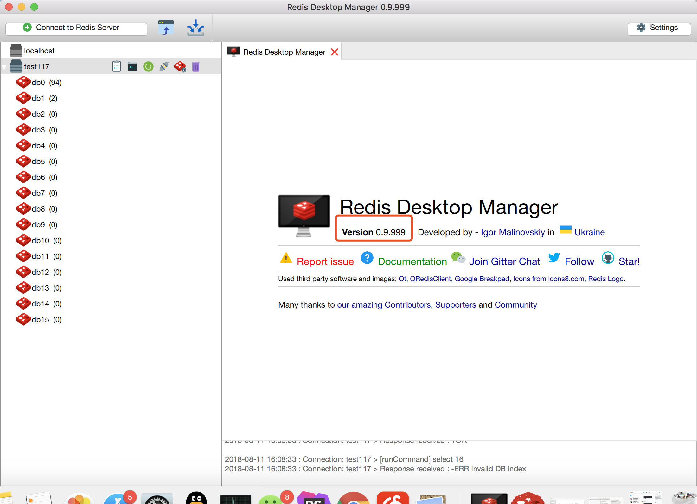

# rdm
## 基于redis-desktop-manager官方源码编译后的应用代码，适用于mac，最好用的redis可视化客户端。
## 版本：0.999(开发版本)

## 用法
- git clone 代码或则 下载压缩包
- 双击目录下的bin目录中的rdm直接运行即可

## 后续更新
- 打包为dmg
- 持续更新编译新版本

## 免责声明
- 本项目只是自己使用，有条件请支持官方项目进行订阅https://redisdesktop.com/。
